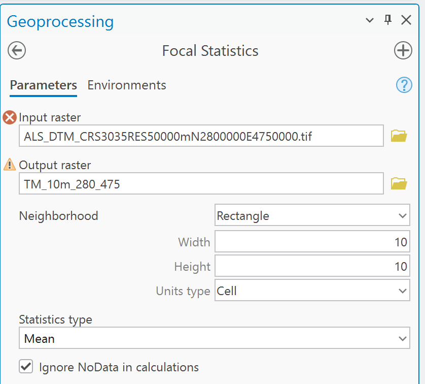
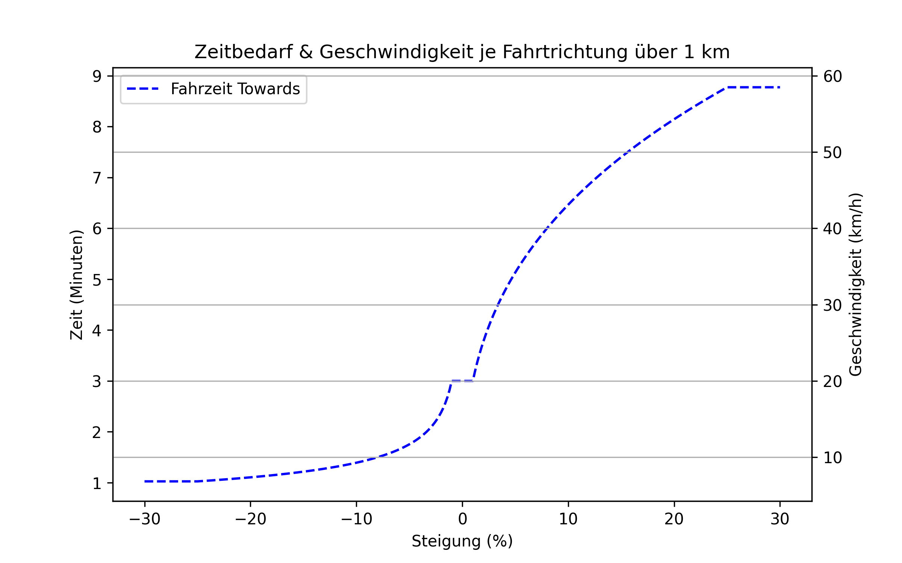

# Netzwerkanalyse
## Vorgehensweise
Allgemeine Methodologie für die Berechnung
### Vorbereitung
Vorbereitung vom Datensatz in mehreren Schritten
#### Gefälle für Bike-Network berechnen

| Schritt | Beschreibung | Screenshot |
|-|-|-|
| 1 | Herunterladen der [DTM-Rasterzellen](https://doi.org/10.48677/5b510b4a-f592-4c02-991f-012cb1a65ea9) | |
| 2 | Rasterzellen simplifizieren (*Focal Statistics, 10x10m mean*) |  |
| 3 | Zusammenfügen der Rasterzellen (*Mosaic to New Raster*) |  |
| 4 | Extrahieren der Start- und Endpunkte (*Feature Vertices To Points*) <br> Layer mit Start Nodes <br> Layer mit End Nodes |  |
| 5 | Projizieren der Start- und End-Nodes auf DTM-Rasterzellen (*Extract Multi Values to Points*) |  |
| 6 | Join an Linknetz (*Join Field, FROM-Node, TO-Node*) |  |
| 7 | Gefälle berechnen: (Z_TO - Z_FROM) / !Shape_Length! x 100 |  |

#### Bike Network bauen
##### Costs:
Dritte Wurzel von Slope in Verbindung mit Distanz, Base Speed = 20 km/h. Die Ausreißer jenseits von 25% Gefälle werden bereinigt.
Eine [realitätsnähere Berechnungsmethode](speedcalc.py) wäre vielleicht möglich...

**Towards:**
```python
from math import pow

def time(slope, length):
    speedmm = 20 * 1000 / 60  # km/h in m/min
    slope = max(-25, min(25, slope))  # Begrenzung
    if slope < -1:
        v = speedmm * pow(abs(slope), 1./3)
    elif slope >= -1 and slope <= 1:
        v = speedmm
    else:
        v = speedmm / pow(abs(slope), 1./3)
    return length / v  # t = s / v (in m/min)
```

**Backwards:**
```python
from math import pow

def time(slope, length):
    speedmm = 20 * 1000 / 60 # km/h in m/min
    slope = max(-25, min(25, slope))  # Begrenzung
    if slope < -1:
        v = speedmm / pow(abs(slope), 1./3)
    elif slope >= -1 and slope <= 1:
        v = speedmm
    else:
        v = speedmm * pow(abs(slope), 1./3)
    return length / v # t = s / v (in m/min)
```
Die Geschwindigkeit und Fahrzeit verteilt sich daher abhängig vom Gefälle wie folgt:



Für Fahrtrichtung Backwards ist die Funktion umgekehrt.

##### Restrictions:
Befahrbarkeit für Fahrrad erlaubt (Realitätsnähe?)

**Towards:**
```python
def restriction(bike):
	if bike == 1:
		return False
	else:
		return True
```
**Backwards** ist das Field Script identisch, nur die Variable wird getauscht: statt *AccTow_Bike* wird *AccBkw_Bike* eingesetzt.

#### DEM & ERW vorbereiten
1. Pairwise Clip von DEM-Rasterdatensatz mit Region
2. Pairwise Clip von Statistikraster (Poly) mit Region
3. DEM: Summieren von Altersgruppen m+w
	- Altersgruppe 1: 5 bis 9-jährige
	- Altersgruppe 2: 10 bis 14-jährige
	- Altersgruppe 3: 15 bis 19-jährige
	- Löschen aller unbenötigten Spalten
	
#### Zusätzliche Layer laden & vorbereiten
1. [Administrative Grenzen](https://www.data.gv.at/katalog/de/dataset/stat_gliederung-osterreichs-in-gemeinden14f53)
	- Bundesländer vereinfacht (*Simplify Polygon, Algorithm Wang-Müller, Tolerance 500 m*)
	- Gemeinden
2. [Flüsse](https://www.data.gv.at/katalog/de/dataset/gesamtgewssernetzfliessgewsserrouten)
	- nach Flussmenge eingefärbt
3. [Waldfläche](https://www.data.gv.at/katalog/de/dataset/waldkarte-bfw-osterreich)

### Import von Zielen
* Öffentliche Schulen nach [Bildungsstufe](https://de.wikipedia.org/wiki/Bildungssystem_in_%C3%96sterreich#/media/Datei:SCHULSYSTEM%C3%B6sterreich2.png)
	- Primärstufe:
		- VS (Volksschule)
		- SS (Sonderschule)
	- Sekundarstufe 1:
		- NMSA (Mittelschule AHS)
		- NMSH (Mittelschule)
		- SS (Sonderschule)
	- Sekundarstufe 2:
		- AHS
		- BMHSK
		- BMHSP
		- BMHST
		- BS
		- LFHS
		- PS

## Maps
In den Maps wird nur exemplarisch eine Bildungsstufe dargestellt, z.B. Sekundarstufe 1

### Einzugsbereiche je Schultyp
- Cutoff: 15km, dann Zuschlag je eine Minute am Quell- und Zielort und filtern nach 30 Minuten Fahrzeit.
- Darstellung von erreichbaren Rasterzellen (!), daher auf Grundlage von O-D-Matrix ausarbeiten
### Fahrzeit zur nächsten Schule je Rasterzelle
- Auf Basis von O-D-Matrix, nur Rang 1
- Darstellung auf Rasterebene
### Anzahl erreichbarer Schulen in Zeitraum
- in unter [27 Minuten](https://www.statistik.at/statistiken/arbeitsmarkt/erwerbstaetigkeit/arbeitsort-und-pendeln)
- Auf Basis von O-D-Matrix, Join mit Rasterzellen
- Darstellung auf Rasterebene
### Mittlere Reisedauer je Gemeinde
- gew. nach Bevölkerung und Schultyp: Zuweisung von Rastermittelpunkt zu Gemeinde, Weg zu nächster Schule; Aggregieren auf Gemeindeebene mit betr. Bevölkerung (Kinder)
- Darstellung auf Gemeindeebene
### Gravitationsbasiertes Potenzial
- Darstellung je Einrichtung
- entweder HWS oder Kinder, die Schultyp zugeordnet werden.

  | Variable      | Bedeutung                          |
  |---------------|------------------------------------|
  | $` A_j `$     | Anzahl Kinder oder Hauptwohnsitze  |
  | $` t_{ij} `$  | Reisezeit |
  | $` \lambda `$ | Halbwertszeit |

Die Formel dafür lautet:\
  $P = \sum_{j=1}^{n} A_j \cdot e^{\beta \cdot t_{ij}}$
wobei
  $\beta = \frac{\ln(2)}{\lambda_t}$

### Vergleichende Darstellung bei konstanter Geschwindigkeit (?)
  Eventuell machen, vielleicht weglassen
## Diagramme
Wie Maps, aber für alle Bildungsstufen: Diagramm mit y = Zielgruppe, x = Zeitklasse
### Base Speed anpassen 

| Bildungsstufe | Geschwindigkeit |
|---------------|-----------------|
| Primär | 12 km/h |
| Sekundär 1 | 16 km/h |
| Sekundär 2 | 20 km/h |

Anschließend Vergleich mit O-D ohne Gefälle (Delta).
